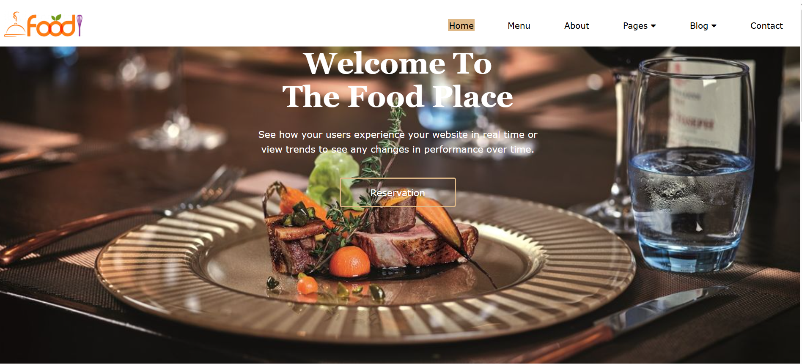
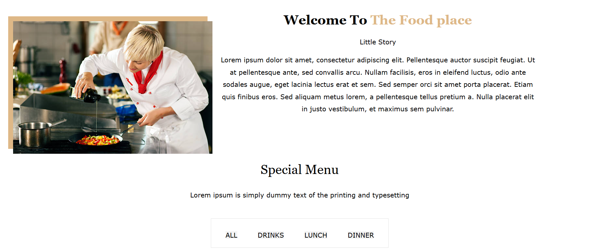
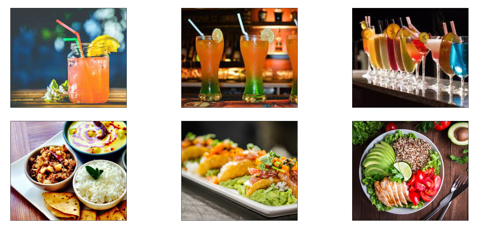

# 🍽️ Food Place Website

A modern and responsive restaurant website built using HTML and CSS. This project showcases a clean user interface with a hero section, navigation bar, about section, and a special menu gallery for food and drinks.

---

## 📖 About the Project

The Food Place Website is a static restaurant-themed web project designed to practice front-end development skills. It features an attractive homepage layout with a welcome banner, about section describing the restaurant story, and a special menu section that displays categorized food and drink items. The project focuses on layout design, image presentation, and responsive styling.

---

## ✨ Features

- Responsive navigation bar with menu links  
- Hero section with welcome message and reservation button  
- About section with restaurant story  
- Special menu categories (All, Drinks, Lunch, Dinner)  
- Food and drink image gallery  
- Clean and modern UI design  
- User-friendly layout  

---
## 🖼️ Screenshots

### Home Page

### About & Special Menu Section

### Food & Drinks Gallery

## 🛠️ Technologies Used

- HTML5  
- CSS3  

---

## 📂 Project Structure

